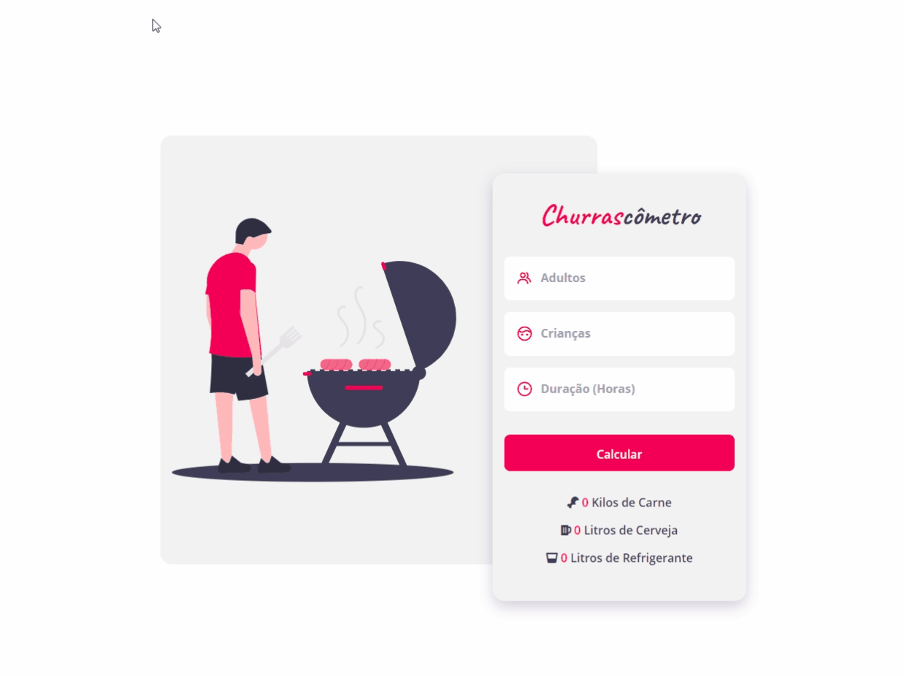
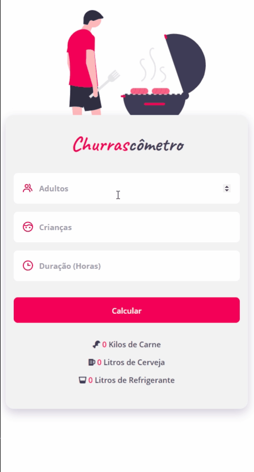

<h1 align="center">
    
</h1>

    <h3> 🥩 Faça o cálculo de quanto gastar no churras! 🥩 </h3>
    
    
     
    

## Churrascômetro

Desafio proposto pelo Igor do curso Programador BR com o intuito de elaborar um sistema em JavaScript que calcula a quantidade necessária de comida e bebida para um churrasco.

  

## 🛠️ Tecnologias

💻 HTML

💻 CSS

💻 JavaScript

## :camera: Veja:

### 🖥️ Desktop

### 📱 Mobile

### ☑️ Código:

## 🌟 Curso Desenvolvimento Web Full Stack

Deixo minha recomendação ao curso do **IGOR OLIVEIRA**. Tenho aprendido muito nessas últimas semanas e o curso tem sido fundamental para o meu aprendizado.

